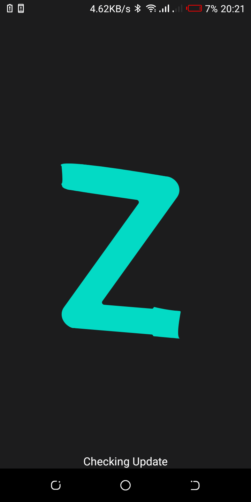
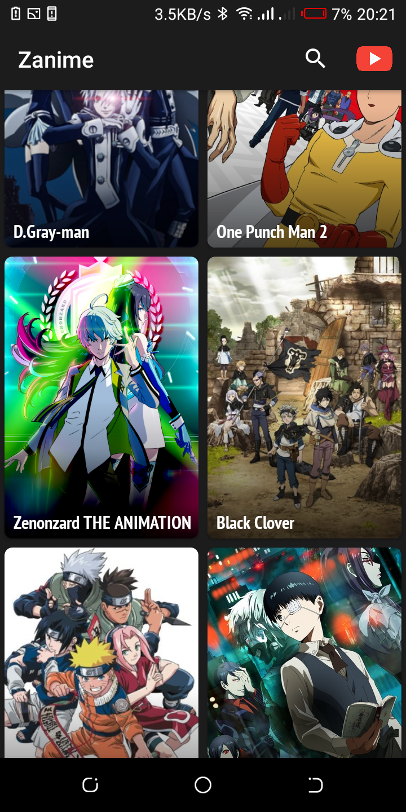
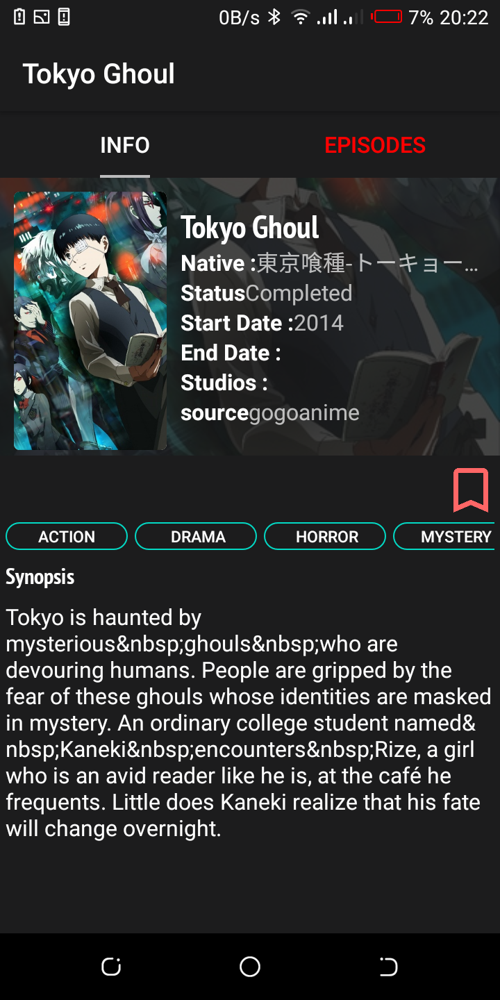
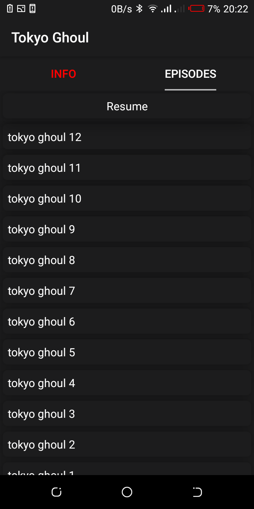
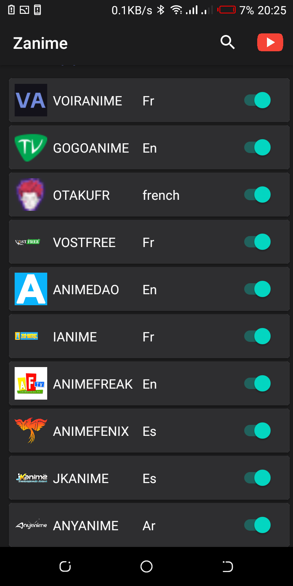
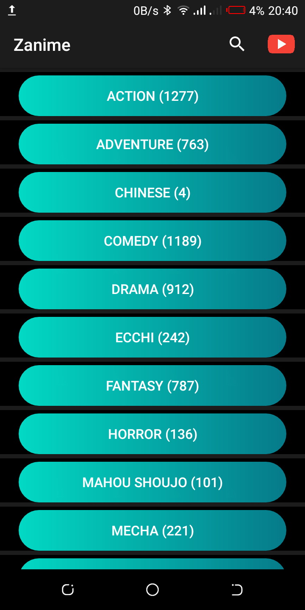
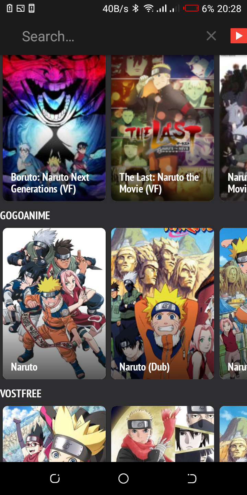
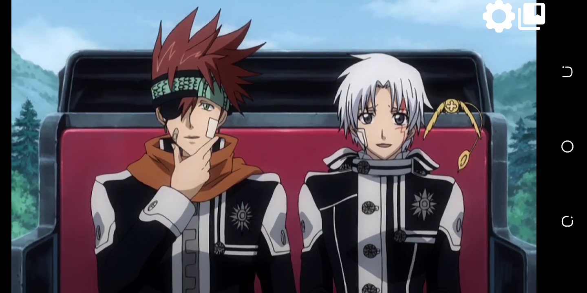
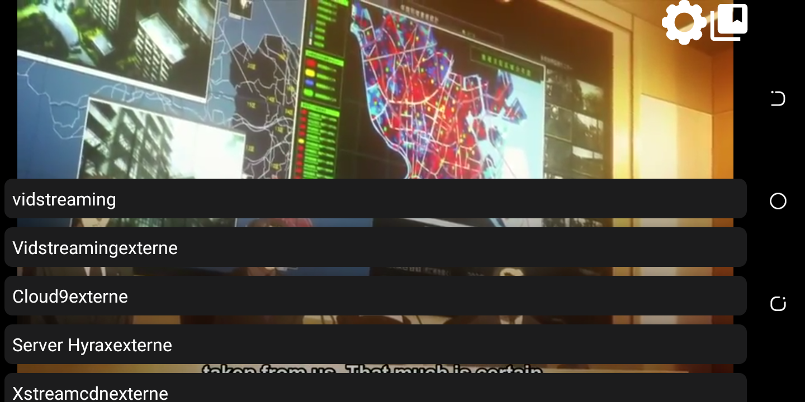

 
 

 
 
<h4 align="center">An Android app to watch anime on your phone</h4>

## Description

Zanime is just a tool to scrape free anime website using jsoup and play video content with Exoplayer or webview. The app doesn't require account creation to use it. 

## Screenshots

## Source List

* [Gogoanime](http://gogoanime.tv/)
* [Animedao](https://animedao.com/)
* [Voiranime](http://voiranime.com/)
* [Otaku Fr](https://www.otakufr.com/)
* [Vostfree](https://vostfree.com/)
* [Ianime](https://www.ianimes.org/)
* [Animefreak](https://www.animefreak.tv/)
* [Animefenix](https://www.animefenix.com/)
* [Jkanime](http://jkanime.net/)
* [Anykanime](https://ww8.anyanime.com/)

## Features

* Resume Episode Support
* Active/Desactive Source
* Multiple Source
* Multiple Search Anime Option
* Filter by categories Support
* Save Favourites Anime
* Mutiple Server for episode
* History Support
* Watch Progress
* Add To Favourites
* Auto Quality for Video Playback

## Dependencies used
* Kotlin
* ExoPlayer
* [Picasso](https://square.github.io/picasso/)
* [Webview Video Fullscreen](https://github.com/RachitShah02/Webview-Video-Fullscreen)

 
 

